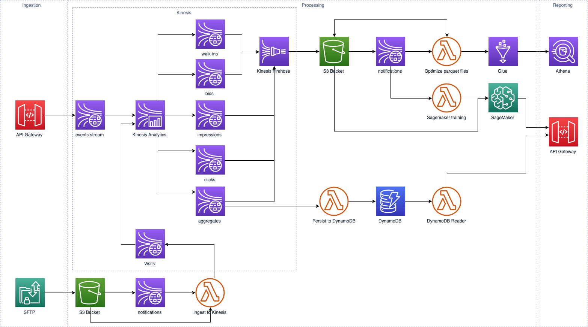

# AWS Native Streaming Data Platform
1. [Overview](#Overview)
    1. [Architecture](#architecture)
    1. [Region availability](#region-availability)
1. [Developing](#developing)
    1. [Build](#build)
    1. [Deploy](#deploy)
    1. [Test](#test)
        1. [Integration](#integration)
        1. [Performance](#performance)
1. [User Guide](#user-guide)
    1. [Data Ingestion](#data-ingestion)
    1. [Reporting](#reporting)
    1. [Machine Learning](#machine-learning)

## Overview
The Streaming Data Platform is a unified solution that enables real-time data analytics and serves as a 
foundational service for AI solutions. Provectus’ streaming-first architecture powers and provides governance for a 
data lake ecosystem. It consolidates data pipelines and improves scalability in the cloud for real-time analysis. 
These well-architected solutions accelerate time-to-market and mitigate technology risks.

Streaming Data Platform is delivered as an AWS CloudFormation template quick start. Resources in the stack depend on 
the region. Use a table below to launch the stack in your region:

| Region  | Launch stack |
| ------------- | ------------- |
| us-east-1  | [](https://console.aws.amazon.com/cloudformation/home?region=us-east-1#/stacks/new?stackName=streaming-data-platform&templateURL=https://streaming-data-platform-releases-us-east-1.s3-us-east-1.amazonaws.com/v1.1.0/fds.template)  |
| us-east-2  | [](https://console.aws.amazon.com/cloudformation/home?region=us-east-2#/stacks/new?stackName=streaming-data-platform&templateURL=https://streaming-data-platform-releases-us-east-2.s3-us-east-2.amazonaws.com/v1.1.0/fds.template)  |
| us-west-2  | [](https://console.aws.amazon.com/cloudformation/home?region=us-west-2#/stacks/new?stackName=streaming-data-platform&templateURL=https://streaming-data-platform-releases-us-west-2.s3-us-west-2.amazonaws.com/v1.1.0/fds.template)  |
| eu-west-1  | [](https://console.aws.amazon.com/cloudformation/home?region=eu-west-1#/stacks/new?stackName=streaming-data-platform&templateURL=https://streaming-data-platform-releases-eu-west-1.s3-eu-west-1.amazonaws.com/v1.1.0/fds.template)  |
| eu-central-1 | [](https://console.aws.amazon.com/cloudformation/home?region=eu-central-1#/stacks/new?stackName=streaming-data-platform&templateURL=https://streaming-data-platform-releases-eu-central-1.s3-eu-central-1.amazonaws.com/v1.1.0/fds.template)  |

### Use Cases
The template is designed for the following initiatives:
- Plug-n-play solution for processing and storing data streams in the AWS cloud
- Migration of Hadoop based on-prem platform to AWS native streaming services
- Migration of legacy Enterprise Service Bus or Data Integration architectures to AWS native platform
- Rearchitecture of Data Warehouse workloads to handle growing data volume and velocity, and to provide capabilities for real-time analytics
- Rearchitecture of slow, inconsistent and always-out-of-date data marts in existing Data Lake or Data Warehouse
- Rearchitecture of duplicated and disjointed real-time and batch pipelines

### Architecture


### How it works

SDP provides API Gateway endpoints for ingestion of real time-messages at high throughput.

All events are pushed to Kinesis Data Streams and are processed in the Blueprint Kinesis Analytics processor, 
which serves as a point of customization to filter, enrich, and aggregate incoming data.

Data lands in S3 buckets in a columnar format, partitioned by date time. 
Smart partitioning system eventually merges them into bigger files to provide sub-second SQL queries on top of Athena.

Aggregated messages are sorted and stored in DynamoDB. They can be accessed by reporting endpoints in API Gateway. 
Each type of message is registered in AWS Glue with associated metadata for catalogizing and self-description purposes. 
AWS Athena acts as an interactive ad-hoc SQL interface on top of those tables. 

Streaming Data Platform provides a blueprint machine learning path, 
with feature collection and continuous model retraining algorithm on top of SageMaker. As a blueprint,
it implements prediction of the probability, winning the bid by the specified price.
 

### Region availability
All services which were used in the stack are available only in the following AWS regions:
- Northern Virginia (`us-east-1`)
- Ohio (`us-east-2`)
- Oregon (`us-west-2`)
- Ireland (`eu-west-1`)
- Frankfurt (`eu-central-1`)
## Developing
### Build
```
mvn clean package
```
### Deploy
Upload build artifacts to S3
```
aws cloudformation package
    --template-file fds-template.yaml
    --s3-bucket <s3-bucket-name>
    --output-template-file fds.yaml
```
Deploy a cloudformation stack:
```
aws cloudformation deploy
    --template-file fds.yaml
    --capabilities CAPABILITY_AUTO_EXPAND CAPABILITY_IAM
    [ --parameter-overrides S3Bucket=<some-value> AggregationPeriod=10 S3ResourceBucket=<some-value>]
    --stack-name <stack-name>
```
Stack outputs:
- `UrlForAPI` - URL for injection requests
- `UrlForReports` - URL for retrieving reports
- `UrlForPredictions` - URL for retrieving predictions

### Test
#### Integration
The integration test is launched in the `us-west-2` region by default.
```
mvn -fn verify -DresourceBucket=<temporaryBucket>
```

Where `temporaryBucket` is a bucket for resources required to create the stack. You may remove it once stack creation is finished.

Test report is stored in `./fds-it/target/surefire-reports/`
#### Performance
[Gatling](https://gatling.io) is used for performance testing
```
docker run -it --rm -e JAVA_OPTS="-Dduration=60 -DbaseUrl=<UrlForAPI> -Dgatling.core.simulationClass=basic.ApiPerformanceTest" -v  `pwd`/gatling:/opt/gatling/user-files -v `pwd`/gatling/results:/opt/gatling/results -v `pwd`/gatling/conf:/opt/gatling/conf denvazh/gatling
```
Test report would be stored in `./gatling/results/`
## User Guide
An architecture is generic enough to support any business use case. For demonstration purposes, a canonical Adtech use case is implemented.
### Data Ingestion
The following data streams are available:
- [Bid](#bid)
- [Click](#click)
- [Impression](#impression)

##### Bid
Ingesting Bids:
```
curl --request POST --header "Content-type: application/json" --data '{"tx_id":"44db4cf3-c372-4f7c-8443-9d2a1e725473","domain":"www.google.com","app_uid":"e582f2a0-3e2b-4066-a2a3-dc5867953d0d","campaign_item_id":1463517,"creative_id":"b72897cb-3f88-423b-84aa-9b7710d2416d","creative_category":"testCreativeCategory"}' '<UrlForAPI>/bid'
```
Bid Schema
```
title: Bid
type: object
properties:
  app_uid:
    required: true
    type: string
  campaign_item_id:
    required: true
    type: integer
  creative_category:
    type: string
  creative_id:
    type: string
  tx_id:
    required: true
    type: string
  domain:
    type: string
  win_price:
    type: integer
  type:
    type: string
    default: bid
```

##### Click
Ingesting Clicks:
```
curl --request POST --header "Content-type: application/json" --data '{"tx_id":"44db4cf3-c372-4f7c-8443-9d2a1e725473"}' '<UrlForAPI>/click'
```
Click Schema
```
title: Click
type: object
properties:
  tx_id:
    required: true
    type: string
  type:
    type: string
    default: click
```

##### Impression
Ingesting Impressions:
```
curl --request POST --header "Content-type: application/json" --data '{"tx_id":"44db4cf3-c372-4f7c-8443-9d2a1e725473","win_price":1}' '<UrlForAPI>/impression'
```

Impression schema:
```
title: Impression
type: object
properties:
  tx_id:
    required: true
    type: string
  win_price:
    required: true
    type: integer
  type:
    type: string
    default: imp
```

### Reporting
Reports are calculated in Amazon Kinesis and stored in `Aggregatio` Stream. 
Aggregated stream is exposed to [realtime consumers](#realtime-reporting), 
as well as to [offline queries](#analytical-queries).

Aggregation Schema:
```
title: Aggregation
type: object
properties:
  campaign_item_id:
    required: true
    type: integer
  period:
    type: integer
  clicks:
    type: integer
  impressions:
    type: integer
  bids:
    type: integer
```
#### Realtime Reporting

Realtime reporting for particular as Ad Campaign is available via API Gateway:

```$xslt
curl -o bid-report.json '<UrlForReports>/reports/campaigns/<campaign_item_id>'
```

#### Analytical Queries
Kinesis Streams are snapshotted and compacted in Amazon S3 for a Data Lake type of workloads. Each table stores a data streams (Bids, Clicks, Impressions, and Aggregations) data type in json or [parquet](https://parquet.apache.org/).

The following tables are available for Athena queries:
- parquet_aggregates and raw_aggregates
- parquet_bcns and raw_bcns
- parquet_clicks and raw_clicks
- parquet_impressions and raw_impressions

#### Machine Learning

Streaming Data Platform has a feature called Continuous Model 
 Training. It's mean that the learning model will retrain as soon as 
 new data is arrived by the Streaming Data Platform.

 You can learn more about SageMaker response format 
 [here](https://docs.aws.amazon.com/en_us/sagemaker/latest/dg/LL-in-formats.html)


```bash
 curl -d \
   '{"campaignItemId":"realCompaignItemId","domain":"realDomain","creativeId":"realCreativeId","creativeCategory":"realCreativeCategory","winPrice":prefferedPrice}' -H "Content-Type: application/json" \
   -X POST ${UrlForPredictions}
 ```

 And the result of this statement may be like this: 

 ```json
 {"predictions": [{"score": 0.9999716281890869, "predicted_label": 1.0}]}
 ```


 